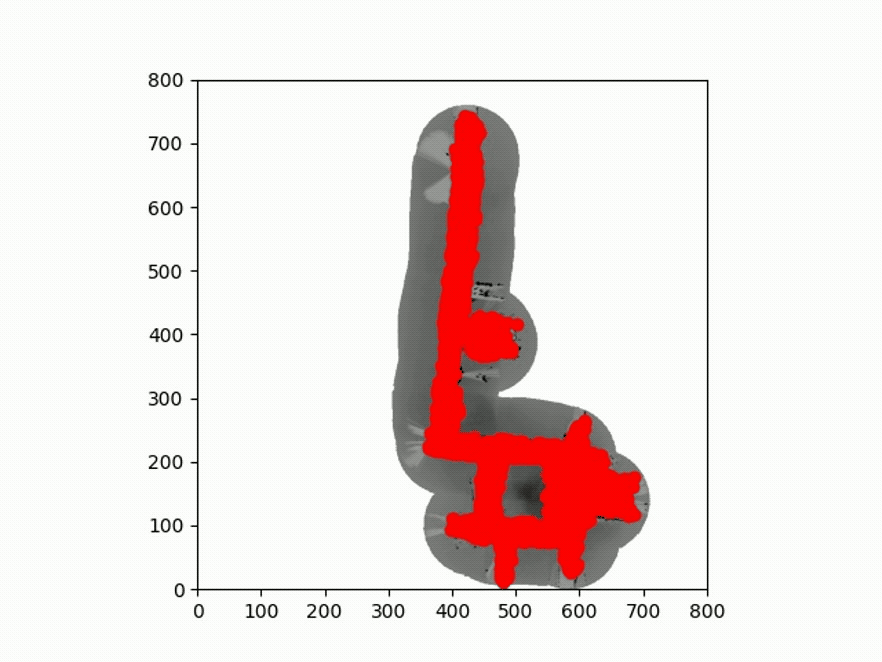

# Robot-Localization-and-Mapping
 ## Extented Kalman Filters (HW 2) 
### Implemented a 2D Extented Kalman Filters (EKF-SLAM) 

## Particle Filters (HW 1) 
### Implemented a global localization filter for a lost robot using 2500 particles

